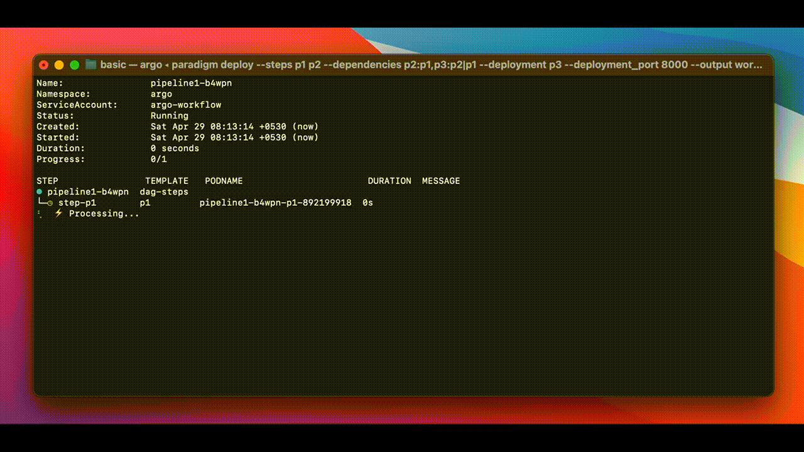

<p align="center">
  
</p>

<p align="center">
    <a href="#"></a>
    <a href="https://discord.gg/KxHPMsBdyp" target="_blank"></a>
    <a href="mailto:paradigmdev23@gmail.com" target="_blank"></a>
    <a href="https://www.paradigmai.net/" target="_blank"></a>
</p>

🌟 **With Paradigm, you ML code is production-ready from the beginning**

Paradigm is a light-weight, lightning-fast, supremely adaptable tool, effortlessly packaging your ML code into robust pipelines for seamless deployment on Kubernetes. Bypass the need for code refactoring as Paradigm intelligently interprets your Python notebooks and scripts, priming them for scalable production. Paradigm is your ultimate ally in ML deployment, merging unparalleled speed, adaptability, and simplicity into one package.

# Paradigm in Action
## Terminal View


## DAG View


# Deploy an ML pipeline in just 2 steps

```console
$ paradigm launch --step <your-project-notebooks-or-scripts>
$ paradigm deploy
```

# Quickstart

## Try Locally 💻

You need a Kubernetes cluster and `kubectl` set up to be able to access that cluster. For this to run locally, we recommend using `minikube`.
- Please refer to the [minikube documentation](https://minikube.sigs.k8s.io/docs/)

### Set up Paradigm

- (Recommended) Create a new Python environment with your preferred environment manager
- Clone this repo 
    - `git clone https://github.com/ParadigmAI/paradigm.git`
- Go into the directory 
    - `cd paradigm`
- Make the installation script executable 
    - `chmod +x install.sh`
- Run the intallation script 
    - `./install.sh`
- Validate if paradigm was properly installed
    - `paradigm --help`

### Now let's move into your ML project folder

Your folder can contain one or more scripts or Python notebooks that you want to execute as steps in an ML pipeline.

- First, let's configure your current terminal session to use the Docker daemon inside the Minikube environment instead of the default Docker daemon on your host machine. This eliminated the need for an image registry when working locally.
    - `eval $(minikube docker-env)`

**From here we follow a basic example project just to make it easier to exaplin the commands. Please change the necessary parameters according to your project**
- The preferred directory structure should be as follows. In the below example, `p1, p2 and p3` represent the names of the python scripts or notebooks you have. (Refer the [examples/basic](./examples/basic))
    - IMPORTANT - Note the `requirements.<file name>` files. You have to create a txt with that specific naming **only for the scripts or notebooks that have additional dependencies**. It becomes the `requirements.txt` for that step. We promise this is the only file addition before taking your ML code to prodution.
    - Example:
```
    - 📁 project_root
        - 📄 p1.py
        - 📄 p2.ipynb
        - 📄 p3.py
        - 📄 requirements.p1
        - 📄 requirements.p3
```

- Now we are ready to let Paradigm get things ready before deploying to Kubernetes. Include the scripts/notebook you want as steps in the below command. This command basically containerizes your code.
```
paradigm launch --steps p1 p2 p3
```
- As the final step, deploy the pipeline with the below command.

```
paradigm deploy --steps p1 p2 --dependencies "p2:p1,p3:p2|p1" --deployment p3 --deployment_port 8000 --output workflow.yaml --name pipeline1
```
- In the above command: 
    - `--steps` should speicify all steps, except any step that should be run as a service, e.g., an API endpoint. 
    - `--dependencies "p2:p1,p3:p2|p1"` defines the graph stucture (DAG) on how the steps should be run. In this example, we are stating that step `p2` is dependent on `p1` and step `p3` is dependent on both `p2` and `p1`. 
    - `--deployment p3` defines a service that needs to be run at the end of the pipeline. Hence, we don't mention is under `--steps`. 
    - `--deployment_port` is defined if the above service is exposed via a specific port internally. 
    - `--name` can be any name that you want to give this particualr pipeline

-  (OPTIONAL) You can use Argo UI to observe all pipelines and get logs. For that, first make it accessible via your browser by running the below command. 
    - `kubectl -n paradigm port-forward deployment/argo-server 2746:2746`
    - Now in your local browser, go to `http://localhost:2746`

- (OPTIONAL) To access the service that is deployed in the previous set (for example an API endpoint), run the following code since we're working inside minikube. 

    - `minikube service deploy-p3 -n paradigm`

- (OPTIONAL) In case you want to delete the running service and deployment, use the following commands. `<deployment_step>` is the name of the file that has the deolyment code.
    - `kubectl delete deployment deploy-<deployment_step> -n paradigm`
    - `kubectl delete service deploy-<deployment_step> -n paradigm`

<br></br>    

## To Deploy in AWS ☁️

You need a Kubernetes cluster and `kubectl` set up to be able to access that cluster. On AWS, we use Amazon Elastic Kubernetes Service (Amazon EKS) for this. 
- Please refer to the [Amazon EKS](https://docs.aws.amazon.com/eks/latest/userguide/getting-started.html) on how to set things up
- Make sure you can [AWS CLI](https://docs.aws.amazon.com/cli/latest/userguide/cli-chap-install.html) installed and configured as well

Also, make sure [Docker](https://docs.docker.com/engine/install/) is installed and running in your environment

### Set up Paradigm

In a terminal with the above kubectl access, follow the below steps.

- (Recommended) Create a new Python environment with your preferred environment manager
- Clone this repo 
    - `git clone https://github.com/ParadigmAI/paradigm.git`
- Go into the directory 
    - `cd paradigm`
- Make the installation script executable 
    - `chmod +x install-aws.sh`
- Run the intallation script 
    - `./install-aws.sh`
- Validate if paradigm was properly installed
    - `paradigm --help`

### Now let's move into your ML project folder

Your folder can contain one or more scripts/notebooks that you want to execute as steps in an ML pipeline.

**From here we follow a basic example project just to make it easier to exaplin the commands. Please change the necessary parameters according to your project**
- The preferred directory structure should be as follows. In the below example, `p1, p2 and p3` represent the names of the python scripts or notebooks you have. (Refer the [examples/basic](./examples/basic))
    - IMPORTANT - Note the `requirements.<file name>` files. You have to create a txt with that specific naming **only for the scripts or notebooks that have additional dependencies**. It becomes the `requirements.txt` for that step. We promise this is the only file addition before taking your ML code to prodution.
    - Example:
```
    - 📁 project_root
        - 📄 p1.py
        - 📄 p2.ipynb
        - 📄 p3.py
        - 📄 requirements.p1
        - 📄 requirements.p3
```

- Now we are ready to let Paradigm get things ready before deploying to Kubernetes. Include the scripts/notebook you want as steps in the below command. This command basically containerizes your code.
```
paradigm launch --steps p1 p2 p3 --region_name us-east-1
```
- As the final step, deploy the pipeline with the below command.

```
paradigm deploy --steps p1 p2 --dependencies "p2:p1,p3:p2|p1" --deployment p3 --deployment_port 8000 --output workflow.yaml --name pipe1 --region_name us-east-1
```
- In the above command: 
    - `--steps` should speicify all steps, except any step that should be run as a service, e.g., an API endpoint. 
    - `--dependencies "p2:p1,p3:p2|p1"` defines the graph stucture (DAG) on how the steps should be run. In this example, we are stating that step `p2` is dependent on `p1` and step `p3` is dependent on both `p2` and `p1`. 
    - `--deployment p3` defines a service that needs to be run at the end of the pipeline. Hence, we don't mention is under `--steps`. 
    - `--deployment_port` is defined if the above service is exposed via a specific port internally. 
    - `--name` can be any name that you want to give this particualr pipeline
    - `--region_name` is the aws region that you want to use

-  (OPTIONAL) You can use Argo UI to observe all pipelines and get logs. For that, first make it accessible via your browser by running the below command. 
    - `kubectl -n paradigm port-forward deployment/argo-server 2746:2746`
    - Now I your local browser, go to `http://localhost:2746`

- (OPTIONAL) In case you want to delete the running service and deployment, use the following commands. `<deployment_step>` is the make of the file that has the deolyment code.
    - `kubectl delete deployment deploy-<deployment_step> -n paradigm`
    - `kubectl delete service deploy-<deployment_step> -n paradigm`


<br/><br/>

## Learn more

| Section | Description |
|-|-|
| [Documentation](https://paradigmai.github.io/paradigm-docs/) | Full documentation and tutorials |
| [Basic Tutorial](https://paradigmai.github.io/paradigm-docs/Tutorials/basic_example/) | The simplest example with Paradigm |


## Contributing

Suggestions on additional features and functionality are highly appreciated. General instructions on how to contribute are mentioned in [CONTRIBUTING](CONTRIBUTING.md)

## Getting help

Please use the issues tracker of this repository to report on any bugs or questions you have.

Also you can join the [DISCORD](https://discord.gg/KxHPMsBdyp)